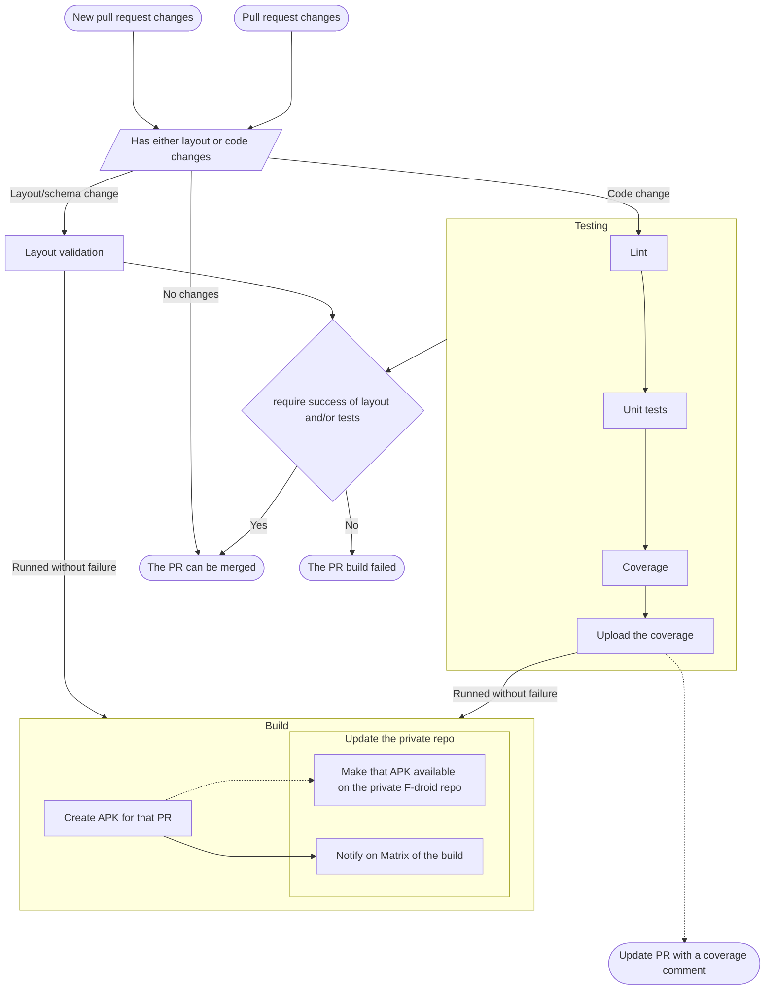

# Pulll request (or PR)

## Warning

Codecov can mark the build as failed but it's not required for the PR to be merged.
If someone knows how to not trigger codecov github checks please let us know

## Process

