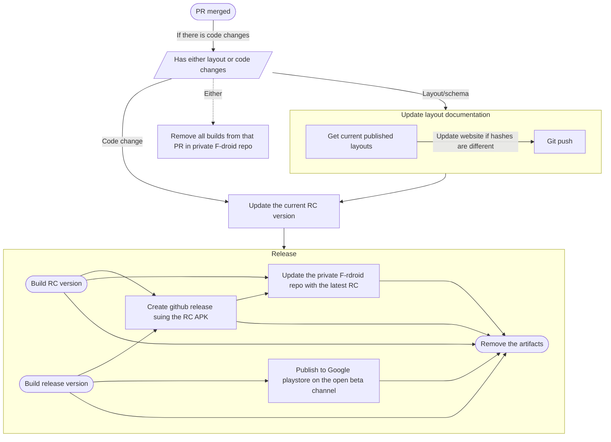

# When a pull request (PR) is mergedo

```mermaid
graph TD
    merged([PR merged]) -- If there is code changes --> changes

    bump_version[Update the current RC version]
    changes[/Has either layout or code changes/]
    changes -- Layout/schema --> layout
    layout --> bump_version
    changes -- Code change --> bump_version
    bump_version --> release
    changes -. Either .-> fdroid_merge[Remove all builds from that PR in private F-droid repo]

    subgraph layout[Update layout documentation]
        website_layouts[Get current published layouts]
        website_layouts -- Update website if hashes are different --> push[Git push]
    end

    subgraph release[Release]
        cleanup([Remove the artifacts])
        github_release[Create github release suing the RC APK]
        private_fdroid[Update the private F-rdroid repo with the latest RC]
        build_rc([Build RC version]) --> github_release
        build([Build release version]) --> github_release
        build --> playstore[Publish to Google playstore on the open beta channel]
        build_rc --> private_fdroid
        github_release --> private_fdroid
        github_release ----> cleanup
        build ----> cleanup
        build_rc ----> cleanup
        playstore ----> cleanup
        private_fdroid ----> cleanup
    end
```
