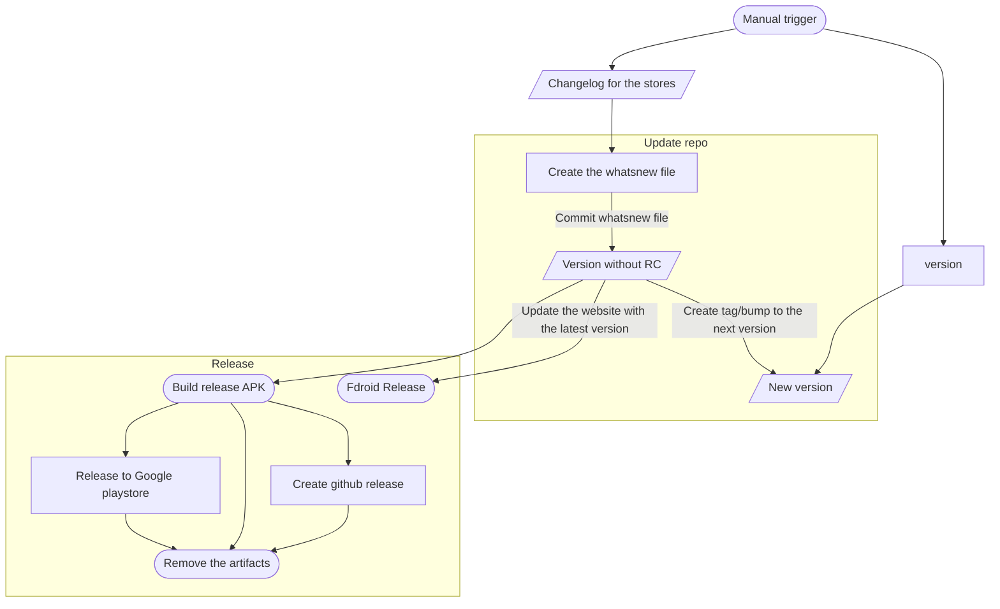

# Release

## Warning

Due to the nature of F-droid, stable versions can take up to 72h to
be available, and in the worst case a week.

```mermaid
graph TD
    whatsnew[/Changelog for the stores/]
    next_version[/"Type of the next version. Either: major, minor (default) or patch"/]

    manual([Manual trigger])

    manual --> whatsnew
    manual --> version

    whatsnew --> write_whatsnew[Create the whatsnew file]
    version --> next_version

    subgraph update_repo[Update repo]
        write_whatsnew -- Commit whatsnew file --> current_version[/Version without RC/]
        current_version -- "Create tag/bump to the next version" --> next_version[/New version/]

    end

    current_version --> build

    subgraph release[Release]
        build([Build release APK]) --> playstore[Release to Google playstore]
        current_version -- Update the website with the latest version --> fdroid([Fdroid Release])
        build --> github_release[Create github release]
        cleanup([Remove the artifacts])
        github_release --> cleanup
        build --> cleanup
        playstore --> cleanup
    end
```
